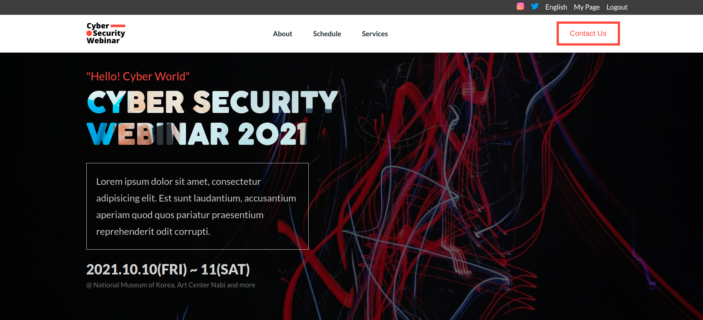
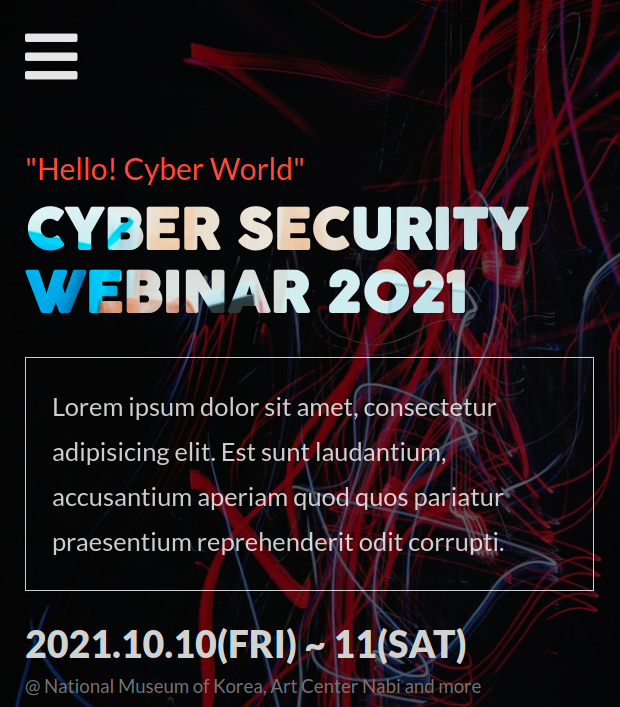
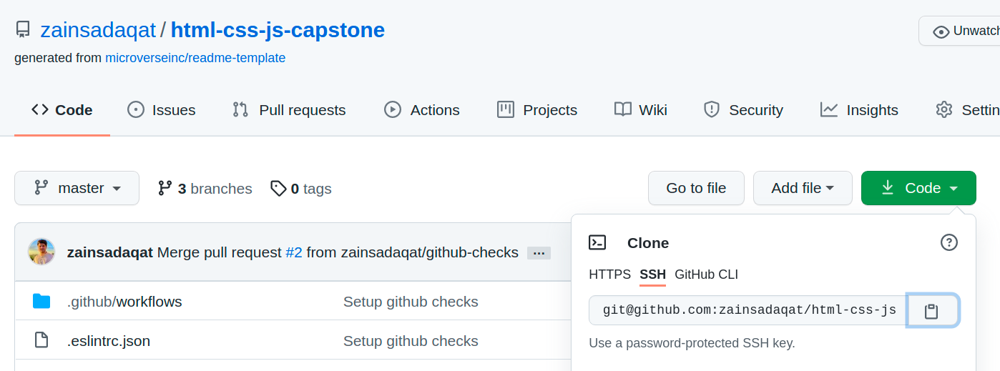
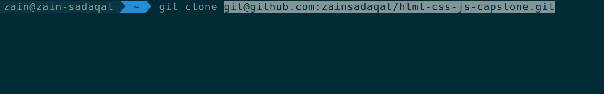

# HTML CSS JS Capstone Project

> Hello, My name is Zain Sadaqat and this is my HTML CSS JS Capstone project. Kindly take a look by visiting the link given below. :)

## Desktop View

## Mobile View

> This project is all about a webinar which is related to Cyber Security and going to held in 2021 and due to COVID it couldn't be held in last years. There're some well-known speakers who will be addressing in this webinar and going to talk about future trend and need of cyber security.

## Live Project Link

> [Live Project Link](https://zainsadaqat.github.io/html-css-js-capstone/)

## Built With

- HTML5
  - Semantic HTML
- CSS3
  - Flexbox
  - Media Queries
- Javascript
  - DOM Manipulation
  - DOM Events
- Font Awesome Icons
- Font Face
  - Lato
  - Cocogoose

## Getting Started

> To get a local copy up and running follow these simple example steps.

### Prerequisites

- You need a code editor ( VS Code Recommended ) and git installed on your machine.
- In case if you don't have installed VS Code then you can download it from the link given below:
  - https://code.visualstudio.com/download
- In case if you don't have installed Git then you can download it from the link given below:
  - https://git-scm.com/downloads

### Setup

- Go to Code and Copy the link
  
- Go to Terminal and type "git clone paste-the-repository-link-that-you-copied"
  
- cd project-name
- run the index.html file in your favourite browser ( Google Chrome Recommended )
- In case if you don't have installed Google Chrome then you can download it from the link given below:
  https://www.google.com/chrome/?brand=CHBD&brand=BNSD&gclid=Cj0KCQjwxdSHBhCdARIsAG6zhlVSZQMe6au8-9f-iIf_kn9aWEShW_wQ0xT5E02lc9jEzHOCdXcHCm8aAgNTEALw_wcB&gclsrc=aw.ds

### Usage

- Project will be open in Desktop view but if you want to check in the mobile view then press
  ctrl + shift + i or right click and select the inspect option and click the mobile icon available
  on left side of the chrome inspector tool and If you're using firefox it's available on right side.

## Author

👤 **Zain Sadaqat**

- GitHub: [@zainsadaqat](https://github.com/zainsadaqat)
- Twitter: [@zain_sadaqat](https://twitter.com/zain_sadaqat)
- LinkedIn: [@zainsadaqat](https://linkedin.com/in/zainsadaqat)
- Instagram: [@zain\_\_sadaqat](https://instagram.com/zain__sadaqat)

## 🤝 Contributing

Contributions, issues, and feature requests are welcome!

Feel free to check the [issues page](../../issues/).

## Show your support

Give a ⭐️ if you like this project!

## Acknowledgments

Original design idea by Cindy Shin in Behance

## 📝 License

This project is [MIT](./MIT.md) licensed.
